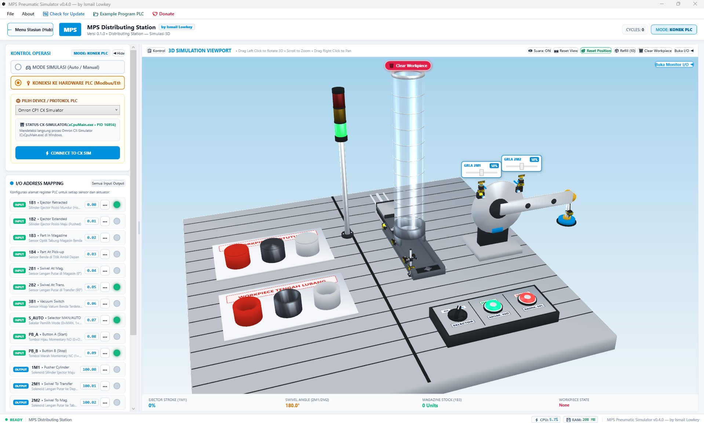
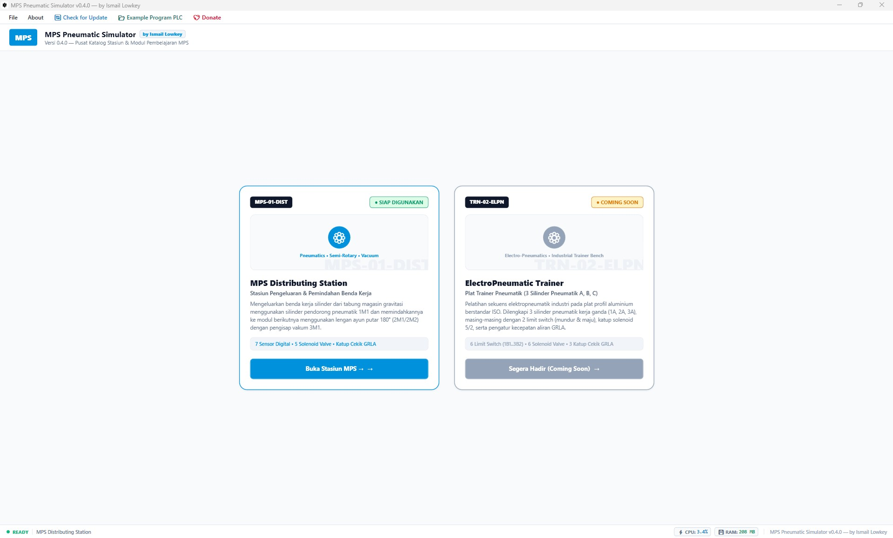
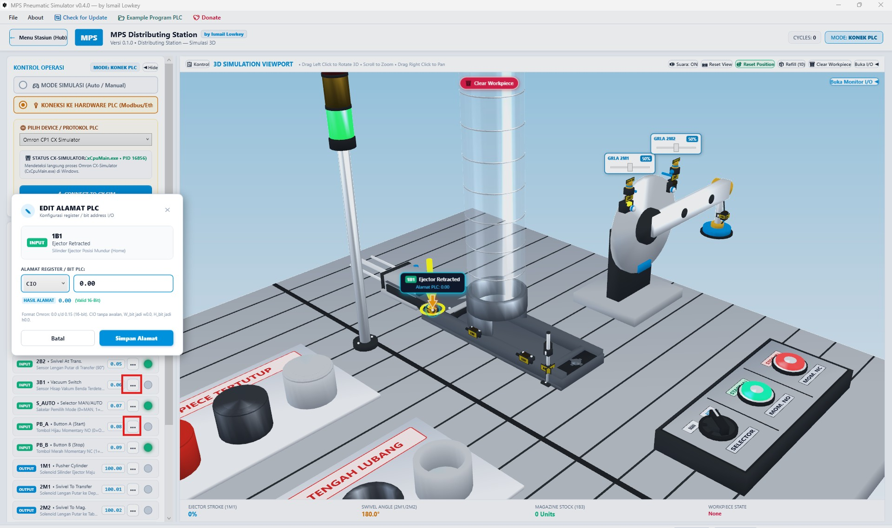
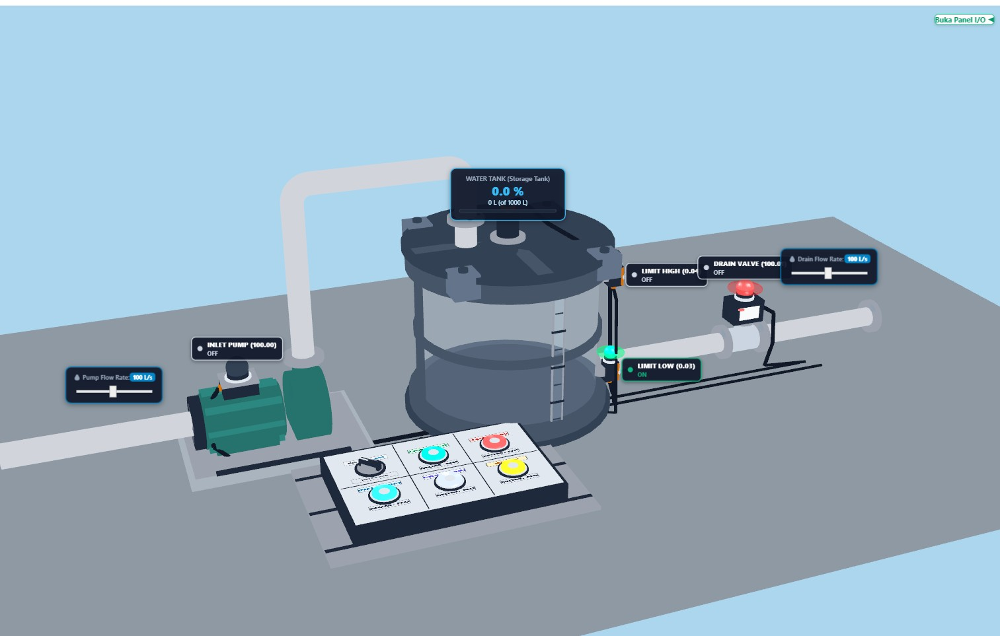

# 🏭 MPS Pneumatic Simulator — Modular Production System 3D & PLC Hub

[](https://github.com/ismaillowkey/MPSPneumaticSimulator/releases)
[](https://github.com/ismaillowkey/MPSPneumaticSimulator/releases)
[](https://dotnet.microsoft.com/)
[](#)
[](https://saweria.co/ismaillowkey)

Selamat datang di repositori resmi distribusi **MPS Pneumatic Simulator** dan kumpulan **Example Program PLC**. Aplikasi ini dirancang untuk mensimulasikan sistem mekatronika dan otomasi industri nyata (*Modular Production System*) secara 3D interaktif real-time yang dapat dikendalikan langsung oleh PLC fisik maupun software simulator PLC (Omron CX-Simulator, Mitsubishi GX Works 2 / GX Works 3 Simulator, Siemens S7-1200 / S7-1500, Modbus TCP, dan Haiwell).

---

## 📥 Download Installer Terbaru

Unduh paket installer setup versi terbaru pada halaman **[GitHub Releases](https://github.com/ismaillowkey/MPSPneumaticSimulator/releases)**:

| Berkas | Platform | Tautan Unduhan |
| :--- | :--- | :--- |
| **MPS Pneumatic Simulator Setup v0.7.1** | Windows 10 / 11 (32-bit / 64-bit) | [Download Setup (.exe / .zip)](https://github.com/ismaillowkey/MPSPneumaticSimulator/releases/latest) |

### Persyaratan Sistem
* **Sistem Operasi:** Windows 10 atau Windows 11 (32-bit / 64-bit)
* **Runtime:** .NET Framework 4.7.2 (terpasang secara bawaan di Windows 10/11)
* **Grafis:** Direct3D / DirectX 9 ke atas (Hardware Accelerated)
* **Ruang Penyimpanan:** ~35 MB

---



---

## 📸 Tangkapan Layar (Screenshots)

| Pusat Katalog Stasiun | Trainer 3 Silinder & Wiring | Modul 3: Water Filling Station |
| :---: | :---: | :---: |
|  |  |  |

---

## 🎬 Video Demo & Cara Penggunaan

https://github.com/user-attachments/assets/demo

https://github.com/ismaillowkey/MPSPneumaticSimulator/raw/main/docs/videos/example_cara_pakai.mp4

> 🎥 **[Klik di sini untuk mengunduh / menonton Video Demo](docs/videos/example_cara_pakai.mp4)** apabila pemutar video di atas tidak tampil secara otomatis di peramban Anda.

---

## ✨ 5 Modul Stasiun Simulasi Industri Utama

MPS Pneumatic Simulator menyediakan 5 modul stasiun industri lengkap berstandar Festo Didactic & otomasi proses modern:

### 1. 🏭 Modul 1: MPS Distributing Station (`MPS-01-DIST`)
Stasiun pengeluaran dan pemindahan benda kerja dari tabung penampung (magasin) ke stasiun berikutnya:
* **Silinder Pendorong (`1M1` / `1B1`-`1B2`):** Mendorong benda kerja keluar dari bawah tabung magasin ke titik penjemputan (*pick-up point*).
* **Lengan Ayun Putar Swivel (`2M1`-`2M2` / `2B1`-`2B2`):** Silinder ayun semi-rotary 0° hingga 90°/180° untuk memindahkan benda kerja.
* **Gripper Vakum Suction Cup (`3M1` / `3B1`):** Pengisap benda kerja menggunakan generator venturi dengan sensor tekanan vakum analog/digital (`3B1`) dan katup pelepas pulsa hembus (*eject pulse* `3M2`).
* **Sensor Magasin & Titik Ambil:** Sensor ketersediaan benda di tabung (`1B3`) dan sensor optik benda di titik penjemputan (`1B4`).
* **Emulasi Benda Bertutup:** Tutup solid (*solid lid*) akan menahan lengan swivel di 5.5° sehingga sensor 2B1 tidak aktif, identik dengan perilaku fisik hardware Festo aslinya.

### 2. ⚡ Modul 2: Electro-Pneumatic Trainer 3 Silinder (`MPS-02-PNEU`)
Meja profil aluminium latihan sekuensial elektropneumatik:
* **3 Silinder Kerja Ganda Horizontal:** Silinder A (`1A1`), Silinder B (`2A1`), dan Silinder C (`3A1`).
* **6 Sensor Magnetik Buluh (Reed Switches):** Sensor posisi mundur (`1B1`, `2B1`, `3B1`) dan maju (`1B2`, `2B2`, `3B2`).
* **3 Katup Solenoid 5/2-Way Bistabil:** `1Y1/1Y2` (Silinder A), `2Y1/2Y2` (Silinder B), dan `3Y1/3Y2` (Silinder C).
* **Katup Cekik Satu Arah Festo GRLA (Flow Control):** Dilengkapi slider interaktif 0–100% dan animasi baut kuningan berulir naik-turun real-time untuk mengatur kecepatan langkah maju/mundur piston.
* **Visualisasi Selang Pneumatik Dinamis:** Jalur selang fleksibel mengembang/berubah warna sesuai tekanan udara aktif.

### 3. 💧 Modul 3: Water Tank Filling & Level Control Simulator (`SIM-03-WATERTANK`)
Simulasi kendali proses otomasi fluida (*Process Automation & Liquid Level Control*):
* **Tangki Akrilik / Stainless 3D:** Dilengkapi visualisasi air transparan dinamis dan pembacaan persentase level analog `D10` / `MW10` (0–100%).
* **Aktuator Pompa & Valve:** Motor pompa pengisi inlet (`INLET_PUMP` / `100.00`) dan katup solenoid pembuangan (`DRAIN_VALVE` / `100.01`).
* **Sensor Pelampung Level:** Sensor pelampung batas bawah (*Float Low* `LIMIT_LOW` / `0.03`) dan batas atas (*Float High* `LIMIT_HIGH` / `0.04`).
* **Kotak Konsol Operator 3 Baris Terintegrasi:**
  - **Baris 1 (Atas):** Selector Switch Manual/Auto (`S_AUTO` / `0.00`), Tombol Start Hijau (`PB_START` / `0.01`), Tombol Stop Merah NC (`PB_STOP` / `0.02`).
  - **Baris 2 (Tengah):** Tombol Momentary Hijau **PB1** (`0.05`), Tombol Momentary Hijau **PB2** (`0.06`), dan pelat penutup modular.
  - **Baris 3 (Bawah):** Pilot Lamp Hijau **L1** (`100.02`), Pilot Lamp Kuning **L2** (`100.03`), Pilot Lamp Merah **L3** (`100.04`).

### 4. 📦 Modul 4: MPS Sorting Station (`MPS-04-SORT`)
Stasiun pemilahan dan penyaluran benda kerja berdasarkan karakteristik fisik & material:
* **Konveyor Belt Bermotor:** Motor penggerak konveyor maju (`M1` / `100.00`) dan mundur (`M2` / `100.01`).
* **Stopper & Deflector Pemilah:** Silinder penahan benda kerja (`1M1` / `100.02`), lengan pemilah deflector 1 (`2M1` / `100.03`), dan lengan pemilah deflector 2 (`2M2` / `100.04`).
* **Sistem Sensor Cerdas 4 Titik:**
  - `B1`: Sensor optik difus di sisi rel masuk (inlet) untuk mendeteksi kehadiran awal benda.
  - `B2`: Sensor optik reflektif (sudut miring jam 10) pembeda warna/karakteristik non-hitam.
  - `B3`: Sensor induktif kepala biru untuk mendeteksi material logam (merah logam / silver logam).
  - `B4`: Sensor retro-reflektif di ujung seluncuran (Normal ON / HIGH, menjadi OFF / LOW sesaat saat benda kerja meluncur melewatinya).
* **Signal Tower 3 Warna:** Lampu menara Merah (`100.05`), Kuning (`100.06`), dan Hijau (`100.07`).

### 5. 🔀 Modul 5: 05 MPS Distributing Sorting Integrated (`MPS-05-DISTSORT`)
Simulasi lini produksi gabungan terpadu (*Modular Integrated Multi-Station*):
* Menggabungkan stasiun pengeluaran benda kerja (Distributing) dan pemilahan (Sorting) dalam satu lintasan kerja kontinu.
* **Antrean Seluncuran Benda Nyata (*Slide Queue Mechanics*):** Benda kerja yang meluncur akan tertata rapi di seluncuran tanpa menimpa satu sama lain (kapasitas hingga 5 benda per seluncuran).
* Tombol interaktif pembersih seluncuran (*Clear Chute Workpieces*) dan sinkronisasi sinyal PLC gabungan untuk latihan pemrograman otomasi tingkat lanjut.

---

## 🔌 Dukungan Driver Protokol PLC Lengkap

Simulator mendukung komunikasi multi-protokol dengan berbagai software simulator dan PLC fisik ternama:

1. **Omron CP1 / CJ / CS (Direct Memory Bridge via NetToCXSim):**
   - Menghubungkan simulator langsung ke software **CX-Programmer / CX-Simulator** tanpa kabel hardware fisik.
   - Mendukung area memori: `CIO` (Bit/Word), `W` (Work Bit), `H` (Holding Bit), dan `D` (Data Memory).
2. **Mitsubishi FX Series (GX Works 2 & GX Works 3 Simulator Bridge):**
   - Mendukung koneksi simulasi internal ke **GX Works 2** (FX3U) dan **GX Works 3** (FX5U) secara instan tanpa perlu virtual serial port tambahan.
   - Mendukung area memori: `X` (Oktal Input), `Y` (Oktal Output), `M` (Auxiliary Relay), `S` (Step Relay), dan `D` / `R` (Data Register).
3. **Siemens S7-1200 / S7-1500 / S7-300 (ISO-on-TCP Port 102):**
   - Komunikasi Ethernet langsung via protokol RFC 1006 / Snap7.
   - Mendukung area: `I` (Input), `Q` (Output), `M` (Memory Bit/Word `MW`), dan `DB` (Data Block).
   - *Catatan PLC Fisik*: Jika terhubung ke hardware PLC Siemens fisik asli, gunakan alamat Internal Memory (`M` / `MW`) pada tabel konfigurasi simulator karena %I fisik terproteksi oleh hardware input cycle.
4. **Modbus TCP (Port 502):**
   - Protokol standar industri universal.
   - Mendukung Discrete Inputs (1xxxx), Coils (0xxxx), Input Registers (3xxxx), dan Holding Registers (4xxxx).
5. **Haiwell Cloud / Ethernet PLC:**
   - Komunikasi Modbus TCP / RTU terintegrasi untuk jajaran PLC Haiwell.

---

## 🎯 Navigasi & Kontrol Kamera 3D

Navigasi viewport 3D dirancang responsif, presisi, dan mudah digunakan:

| Aksi Mouse / Input | Fungsi |
| :--- | :--- |
| **Klik Kiri Drag (Left Button Drag)** | **Orbit / Rotasi Kamera Bebas** (Mengatur sudut pandang Yaw & Pitch) |
| **Klik Kanan Drag (Right Button Drag)** | **Pan / Geser Bidang Kamera** (Menggeser posisi titik fokus X & Y) |
| **Putar Roda Mouse (Mouse Wheel Scroll)** | **Zoom In / Zoom Out** (Mendekatkan / menjauhkan jarak pandang) |
| **Klik Tombol Titik Tiga (`•••`) di Tabel I/O** | **Pinpoint Target Marker 3D** (Menampilkan cincin target, label melayang, dan panah membal penunjuk lokasi fisik sensor / aktuator di viewport 3D) |
| **Klik Benda Kerja di Palet (Modul 1 & 5)** | Memasukkan benda kerja baru (Merah, Hitam, atau Silver) ke tabung penampung magasin |
| **Klik Tombol Kosongkan Magasin** | Mengosongkan tabung magasin seketika |
| **Klik Benda Kerja di Seluncuran (Modul 4 & 5)**| Mengambil atau membersihkan benda kerja dari jalur peluncur sortir |

---

## 📂 Katalog Contoh Program PLC (Example program PLC/)

Folder **Example program PLC/** menyediakan file ladder diagram siap pakai yang dapat langsung dibuka dan dijalankan:

```text
📁 Example program PLC/
├── 📁 01_MPS_Distributing_Station/
│   ├── 📁 Mitsubishi-FX3-GXSimulator2/
│   │   └── 📄 mitsubishi_fx3u_gxsimulator2.gxw   # Proyek FX3U untuk GX Works 2
│   ├── 📁 Mitsubishi-FX5-GXSimulator3/
│   │   └── 📄 mpsdistributing_fx5u.gx3           # Proyek FX5U untuk GX Works 3
│   ├── 📁 Omron_CP1/
│   │   ├── 📄 mps_distributing.cxp               # Proyek Omron CX-Programmer
│   │   └── 📄 mps_distributing.opt
│   └── 📁 Siemens_S7-1500/
│       └── 📄 test123.zap21                      # Proyek TIA Portal S7-1500
│
├── 📁 02_ElectroPneumatic_Trainer_3Cylinder/
│   └── 📁 OmronCP1/
│       ├── 📄 Electropneumatic_omronCP1.cxp      # Sekuensial 3 Silinder Omron
│       └── 📄 Electropneumatic_omronCP1.opt
│
├── 📁 03_FillingWater/
│   └── 📁 OmronCP1/
│       ├── 📄 FillingWater_omronCP1.cxp          # Kontrol Pompa, Level & Konsol
│       └── 📄 FillingWater_omronCP1.opt
│
├── 📁 04_MPS_Sorting/
│   └── 📁 Mitsubishi_FX5/
│       └── 📄 Sorting_ladder.gx3                 # Pemilahan Material GX Works 3
│
└── 📁 05_MPS_Distributing_Sorting/
    └── 📁 Omron_CP1_CX_Simulator/
        ├── 📄 mps_distributing_sorting.cxp       # Lini Produksi Terpadu Omron
        └── 📄 mps_distributing_sorting.opt
```

---

## 🚀 Panduan Cepat Menghubungkan ke PLC Simulator

### Menghubungkan ke Omron CX-Programmer (CX-Simulator):
1. Buka file proyek `.cxp` pada folder `Example program PLC/` menggunakan **Omron CX-Programmer**.
2. Nyalakan simulator internal CX-Programmer: pilih menu **Simulation ➔ Work Online Simulator** (atau tekan `Ctrl + Shift + W`).
3. Jalankan **MPS Pneumatic Simulator** dan buka stasiun yang diinginkan.
4. Pada panel kiri (Operasi & PLC), pilih mode **Koneksi ke Hardware PLC**.
5. Pilih protokol: `Omron CP1 CX Simulator (Direct Memory)` lalu klik **Hubungkan ke PLC**.
6. Sinyal I/O akan langsung tersinkronisasi secara dua arah real-time!

### Menghubungkan ke Mitsubishi GX Works 2 / GX Works 3:
1. Buka proyek `.gxw` (GX Works 2) atau `.gx3` (GX Works 3).
2. Jalankan simulasi offline: pilih menu **Debug ➔ Start/Stop Simulation**.
3. Di MPS Pneumatic Simulator, pilih protokol: `Mitsubishi FX Series / GX Works Simulator`.
4. Klik **Hubungkan ke PLC**. Simulator akan otomatis mendeteksi memory buffer engine GX Simulator.

---

## 📋 Tabel Referensi Pemetaan Alamat I/O

Gunakan tabel pemetaan default berikut sebagai acuan pembuatan program ladder PLC. Anda juga dapat mengubah alamat secara bebas pada tabel I/O panel kiri simulator:

### Modul 1: MPS Distributing Station (`MPS-01-DIST`)
| Tag | Tipe | Deskripsi Fungsi | Omron CP1 | Mitsubishi | Siemens S7 | Modbus TCP |
| :--- | :--- | :--- | :--- | :--- | :--- | :--- |
| `1B1` | INPUT | Silinder Dorong Mundur (Home) | `0.00` | `X0` | `I0.0` | `10001` |
| `1B2` | INPUT | Silinder Dorong Maju (Pushed) | `0.01` | `X1` | `I0.1` | `10002` |
| `1B3` | INPUT | Sensor Ketersediaan Benda di Magasin | `0.02` | `X2` | `I0.2` | `10003` |
| `1B4` | INPUT | Sensor Optik Titik Ambil (*Pick-up*) | `0.03` | `X3` | `I0.3` | `10004` |
| `2B1` | INPUT | Lengan Swivel di Posisi Magasin (0°) | `0.04` | `X4` | `I0.4` | `10005` |
| `2B2` | INPUT | Lengan Swivel di Posisi Transfer (90°/180°) | `0.05` | `X5` | `I0.5` | `10006` |
| `3B1` | INPUT | Sensor Tekanan Vakum Hisap Benda (*VPEV*) | `0.06` | `X6` | `I0.6` | `10007` |
| `S_AUTO`| INPUT | Sakelar Selector Auto (1) / Manual (0) | `0.07` | `X7` | `I0.7` | `10008` |
| `PB_A` | INPUT | Tombol Start Konsol (NO Momentary) | `0.08` | `X10` | `I1.0` | `10009` |
| `PB_B` | INPUT | Tombol Stop Konsol (NC Momentary) | `0.09` | `X11` | `I1.1` | `10010` |
| `1M1` | OUTPUT | Solenoid Silinder Dorong Maju | `100.00` | `Y0` | `Q0.0` | `00001` |
| `2M1` | OUTPUT | Solenoid Swivel Putar Maju ke Transfer | `100.01` | `Y1` | `Q0.1` | `00002` |
| `2M2` | OUTPUT | Solenoid Swivel Putar Mundur ke Magasin | `100.02` | `Y2` | `Q0.2` | `00003` |
| `3M1` | OUTPUT | Solenoid Generator Vakum Suction ON | `100.03` | `Y3` | `Q0.3` | `00004` |
| `3M2` | OUTPUT | Solenoid Pulsa Hembus Pelepas Benda | `100.04` | `Y4` | `Q0.4` | `00005` |
| `LIGHT_G`| OUTPUT | Lampu Menara Hijau (*Running*) | `100.05` | `Y5` | `Q0.5` | `00006` |
| `LIGHT_Y`| OUTPUT | Lampu Menara Kuning (*Standby*) | `100.06` | `Y6` | `Q0.6` | `00007` |
| `LIGHT_R`| OUTPUT | Lampu Menara Merah (*Fault / Alarm*) | `100.07` | `Y7` | `Q0.7` | `00008` |

---

### Modul 2: Electro-Pneumatic Trainer 3 Silinder (`MPS-02-PNEU`)
| Tag | Tipe | Deskripsi Fungsi | Omron CP1 | Mitsubishi | Siemens S7 | Modbus TCP |
| :--- | :--- | :--- | :--- | :--- | :--- | :--- |
| `1B1` | INPUT | Sensor Silinder A Mundur (Home) | `0.00` | `X0` | `I0.0` | `10001` |
| `1B2` | INPUT | Sensor Silinder A Maju (Extended) | `0.01` | `X1` | `I0.1` | `10002` |
| `2B1` | INPUT | Sensor Silinder B Mundur (Home) | `0.02` | `X2` | `I0.2` | `10003` |
| `2B2` | INPUT | Sensor Silinder B Maju (Extended) | `0.03` | `X3` | `I0.3` | `10004` |
| `3B1` | INPUT | Sensor Silinder C Mundur (Home) | `0.04` | `X4` | `I0.4` | `10005` |
| `3B2` | INPUT | Sensor Silinder C Maju (Extended) | `0.05` | `X5` | `I0.5` | `10006` |
| `1Y1` | OUTPUT | Solenoid Katup Silinder A Maju (A+) | `100.00` | `Y0` | `Q0.0` | `00001` |
| `1Y2` | OUTPUT | Solenoid Katup Silinder A Mundur (A-) | `100.01` | `Y1` | `Q0.1` | `00002` |
| `2Y1` | OUTPUT | Solenoid Katup Silinder B Maju (B+) | `100.02` | `Y2` | `Q0.2` | `00003` |
| `2Y2` | OUTPUT | Solenoid Katup Silinder B Mundur (B-) | `100.03` | `Y3` | `Q0.3` | `00004` |
| `3Y1` | OUTPUT | Solenoid Katup Silinder C Maju (C+) | `100.04` | `Y4` | `Q0.4` | `00005` |
| `3Y2` | OUTPUT | Solenoid Katup Silinder C Mundur (C-) | `100.05` | `Y5` | `Q0.5` | `00006` |

---

### Modul 3: Water Tank Filling & Level Control Simulator (`SIM-03-WATERTANK`)
| Tag | Tipe | Deskripsi Fungsi | Omron CP1 | Mitsubishi | Siemens S7 | Modbus TCP |
| :--- | :--- | :--- | :--- | :--- | :--- | :--- |
| `S_AUTO` | INPUT | Sakelar Selector Auto (1) / Manual (0) | `0.00` | `X0` | `I0.0` | `10001` |
| `PB_START` | INPUT | Tombol Start Pengisian Tangki (NO) | `0.01` | `X1` | `I0.1` | `10002` |
| `PB_STOP` | INPUT | Tombol Stop Pompa Tangki (NC) | `0.02` | `X2` | `I0.2` | `10003` |
| `LIMIT_LOW` | INPUT | Sensor Batas Bawah Tangki (Level $\le$ 25%) | `0.03` | `X3` | `I0.3` | `10004` |
| `LIMIT_HIGH`| INPUT | Sensor Batas Atas Tangki (Level $\ge$ 85%) | `0.04` | `X4` | `I0.4` | `10005` |
| `PB1` | INPUT | Tombol Hijau Momentary PB1 Konsol (NO) | `0.05` | `X5` | `I0.5` | `10006` |
| `PB2` | INPUT | Tombol Hijau Momentary PB2 Konsol (NO) | `0.06` | `X6` | `I0.6` | `10007` |
| `PERCENT_FULL`| ANALOG/WORD | Tingkat Persentase Isi Air (0–100%) | `D10` | `D10` | `MW10` | `40001` |
| `INLET_PUMP`| OUTPUT | Motor Pompa Pengisi Air Masuk | `100.00` | `Y0` | `Q0.0` | `00001` |
| `DRAIN_VALVE`| OUTPUT | Katup Solenoid Pembuangan Air | `100.01` | `Y1` | `Q0.1` | `00002` |
| `L1` | OUTPUT | Pilot Lamp Hijau Konsol Operator | `100.02` | `Y2` | `Q0.2` | `00003` |
| `L2` | OUTPUT | Pilot Lamp Kuning Konsol Operator | `100.03` | `Y3` | `Q0.3` | `00004` |
| `L3` | OUTPUT | Pilot Lamp Merah Konsol Operator | `100.04` | `Y4` | `Q0.4` | `00005` |

---

### Modul 4: Festo MPS Sorting Station (`MPS-04-SORT`)
| Tag | Tipe | Deskripsi Fungsi | Omron CP1 | Mitsubishi | Siemens S7 | Modbus TCP |
| :--- | :--- | :--- | :--- | :--- | :--- | :--- |
| `B1` | INPUT | Sensor Optik Difus Rel Sisi Masuk (Inlet) | `0.00` | `X0` | `I0.0` | `10001` |
| `B2` | INPUT | Sensor Optik Rel Belakang (Miring Jam 10) | `0.01` | `X1` | `I0.1` | `10002` |
| `B3` | INPUT | Sensor Induktif Kepala Biru (Deteksi Logam) | `0.02` | `X2` | `I0.2` | `10003` |
| `B4` | INPUT | Sensor Retro-Reflektif Chute (Normal ON / Meluncur OFF)| `0.03` | `X3` | `I0.3` | `10004` |
| `S_AUTO` | INPUT | Sakelar Selector Auto (1) / Manual (0) | `0.04` | `X4` | `I0.4` | `10005` |
| `PB_START` | INPUT | Tombol Start Siklus (NO Momentary) | `0.05` | `X5` | `I0.5` | `10006` |
| `PB_STOP` | INPUT | Tombol Stop Siklus (NC Momentary) | `0.06` | `X6` | `I0.6` | `10007` |
| `M1` | OUTPUT | Motor Konveyor Maju (Ke Kanan) | `100.00` | `Y0` | `Q0.0` | `00001` |
| `M2` | OUTPUT | Motor Konveyor Mundur (Ke Kiri) | `100.01` | `Y1` | `Q0.1` | `00002` |
| `1M1` | OUTPUT | Solenoid Stopper Benda Kerja Konveyor | `100.02` | `Y2` | `Q0.2` | `00003` |
| `2M1` | OUTPUT | Solenoid Deflector Pemilah 1 (Chute 1) | `100.03` | `Y3` | `Q0.3` | `00004` |
| `2M2` | OUTPUT | Solenoid Deflector Pemilah 2 (Chute 2) | `100.04` | `Y4` | `Q0.4` | `00005` |
| `LAMP_RED` | OUTPUT | Lampu Menara Merah (*Alarm / Stop*) | `100.05` | `Y5` | `Q0.5` | `00006` |
| `LAMP_YELLOW`| OUTPUT | Lampu Menara Kuning (*Standby / Waiting*)| `100.06` | `Y6` | `Q0.6` | `00007` |
| `LAMP_GREEN` | OUTPUT | Lampu Menara Hijau (*Conveyor Running*) | `100.07` | `Y7` | `Q0.7` | `00008` |

---

### Modul 5: 05 MPS Distributing Sorting Integrated (`MPS-05-DISTSORT`)
| Tag | Tipe | Deskripsi Fungsi | Omron CP1 | Mitsubishi | Siemens S7 | Modbus TCP |
| :--- | :--- | :--- | :--- | :--- | :--- | :--- |
| `1B1` | INPUT | Silinder Dorong Mundur (Home) | `0.00` | `X0` | `I0.0` | `10001` |
| `1B2` | INPUT | Silinder Dorong Maju (Pushed) | `0.01` | `X1` | `I0.1` | `10002` |
| `1B3` | INPUT | Sensor Benda di Magasin | `0.02` | `X2` | `I0.2` | `10003` |
| `1B4` | INPUT | Sensor Benda di Titik Ambil (Pick-up) | `0.03` | `X3` | `I0.3` | `10004` |
| `2B1` | INPUT | Lengan Swivel di Magasin (0°) | `0.04` | `X4` | `I0.4` | `10005` |
| `2B2` | INPUT | Lengan Swivel di Transfer (180°) | `0.05` | `X5` | `I0.5` | `10006` |
| `3B1` | INPUT | Sensor Tekanan Vakum OK | `0.06` | `X6` | `I0.6` | `10007` |
| `B1` | INPUT | Sensor Optik Difus Rel Sisi Masuk (Inlet) | `0.07` | `X7` | `I0.7` | `10008` |
| `B2` | INPUT | Sensor Optik Rel Belakang (Miring Jam 10) | `0.08` | `X10` | `I1.0` | `10009` |
| `B3` | INPUT | Sensor Induktif Kepala Biru (Deteksi Logam) | `0.09` | `X11` | `I1.1` | `10010` |
| `B4` | INPUT | Sensor Retro-Reflektif Seluncuran Chute | `0.10` | `X12` | `I1.2` | `10011` |
| `S_AUTO` | INPUT | Sakelar Selector Auto (1) / Manual (0) | `0.11` | `X13` | `I1.3` | `10012` |
| `PB_START`| INPUT | Tombol Start Siklus (NO Momentary) | `0.12` | `X14` | `I1.4` | `10013` |
| `PB_STOP` | INPUT | Tombol Stop Siklus (NC Momentary) | `0.13` | `X15` | `I1.5` | `10014` |
| `PB_RESET`| INPUT | Tombol Reset Siklus (NO Momentary) | `0.14` | `X16` | `I1.6` | `10015` |
| `1M1` | OUTPUT | Solenoid Pendorong Magasin Maju | `100.00` | `Y0` | `Q0.0` | `00001` |
| `2M1` | OUTPUT | Swivel Putar ke Transfer (180°) | `100.01` | `Y1` | `Q0.1` | `00002` |
| `2M2` | OUTPUT | Swivel Putar ke Magasin (0°) | `100.02` | `Y2` | `Q0.2` | `00003` |
| `3M1` | OUTPUT | Solenoid Generator Vakum ON | `100.03` | `Y3` | `Q0.3` | `00004` |
| `3M2` | OUTPUT | Katup Ejector Pulse (Lepas Benda) | `100.04` | `Y4` | `Q0.4` | `00005` |
| `M1` | OUTPUT | Motor Konveyor Maju (Ke Kanan) | `100.05` | `Y5` | `Q0.5` | `00006` |
| `M2` | OUTPUT | Motor Konveyor Mundur (Ke Kiri) | `100.06` | `Y6` | `Q0.6` | `00007` |
| `4M1` | OUTPUT | Solenoid Stopper Konveyor (Single) | `100.07` | `Y7` | `Q0.7` | `00008` |
| `2M3` | OUTPUT | Solenoid Deflector 1 (Seluncuran 1) | `100.08` | `Y10` | `Q1.0` | `00009` |
| `2M4` | OUTPUT | Solenoid Deflector 2 (Seluncuran 2) | `100.09` | `Y11` | `Q1.1` | `00010` |
| `LIGHT_G`| OUTPUT | Lampu Menara Hijau (*Running*) | `100.10` | `Y12` | `Q1.2` | `00011` |
| `LIGHT_Y`| OUTPUT | Lampu Menara Kuning (*Standby*) | `100.11` | `Y13` | `Q1.3` | `00012` |
| `LIGHT_R`| OUTPUT | Lampu Menara Merah (*Alarm / Stop*) | `100.12` | `Y14` | `Q1.4` | `00013` |

---

## 🤝 Kontribusi & Request Contoh Program PLC

Apakah Anda memiliki program PLC untuk stasiun MPS ini menggunakan merk dan platform lain seperti:
* **Siemens (TIA Portal / S7-1200 / S7-1500 / S7-300)**
* **Mitsubishi (GX Works 2 / GX Works 3)**
* **Schneider Electric (EcoStruxure Machine Expert)**
* **Beckhoff (TwinCAT 3)**
* **Omron (Sysmac Studio / CX-Programmer)**

Silakan kirimkan berkas program Anda melalui **Pull Request** ke folder `Example program PLC/` agar dapat dipelajari dan dimanfaatkan oleh komunitas otomasi & mekatronika!

---

## 💖 Dukung Pengembang

Aplikasi ini dikembangkan secara independen untuk mendukung pendidikan otomasi, mekatronika, dan vokasi di Indonesia. Jika aplikasi dan contoh program ini bermanfaat untuk Anda, pertimbangkan untuk memberikan donasi secangkir kopi:

👉 **[Dukung melalui Saweria (https://saweria.co/ismaillowkey)](https://saweria.co/ismaillowkey)**

---

**Dikembangkan oleh:** [Ismail Lowkey](https://github.com/ismaillowkey)  
**Tautan Repositori:** [https://github.com/ismaillowkey/MPSPneumaticSimulator](https://github.com/ismaillowkey/MPSPneumaticSimulator)
